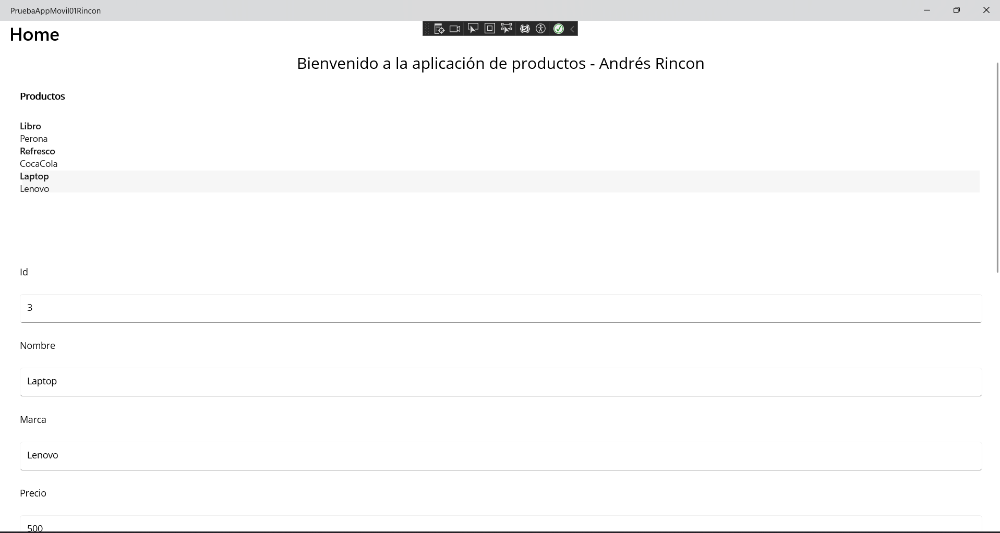
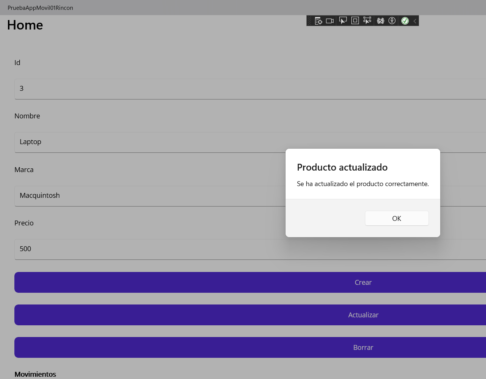
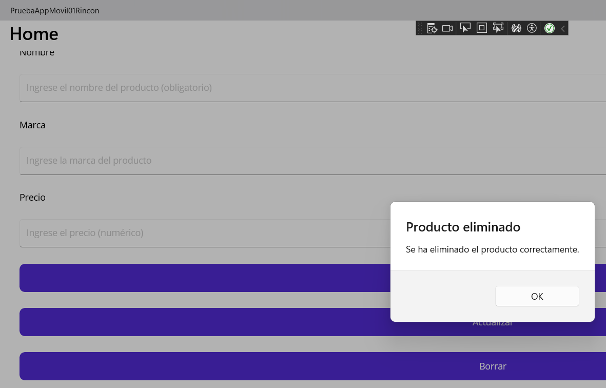
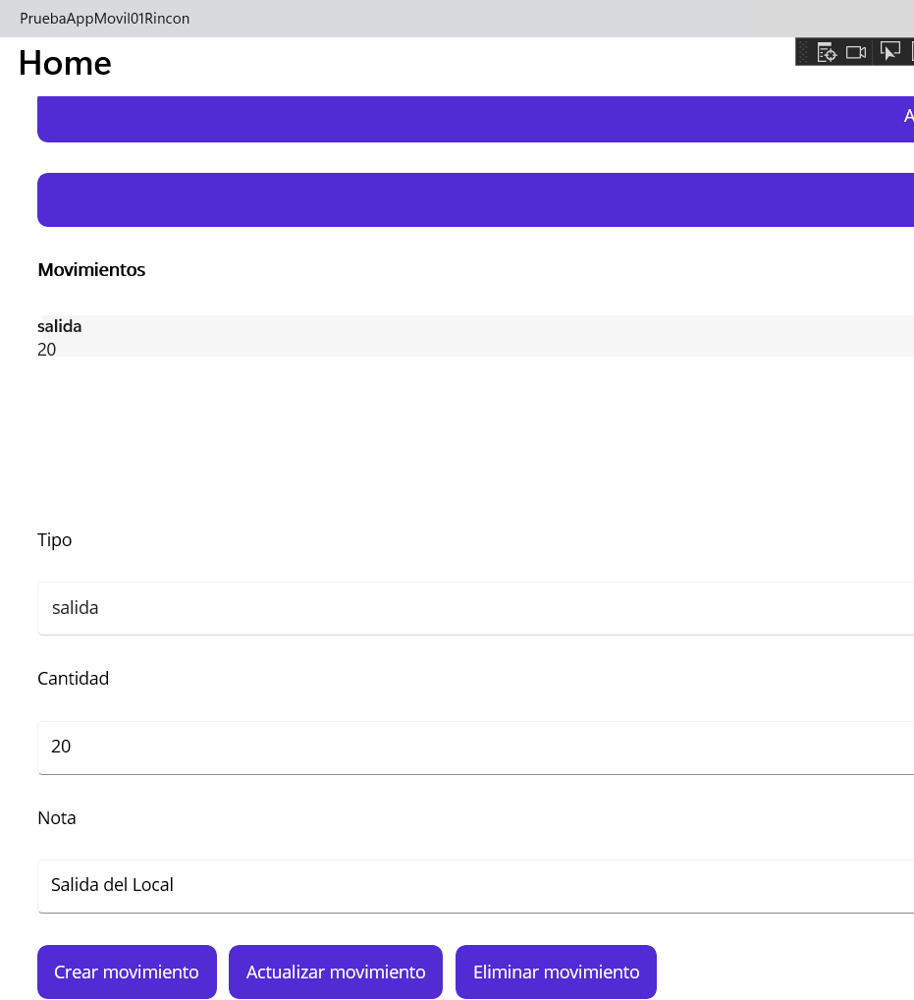
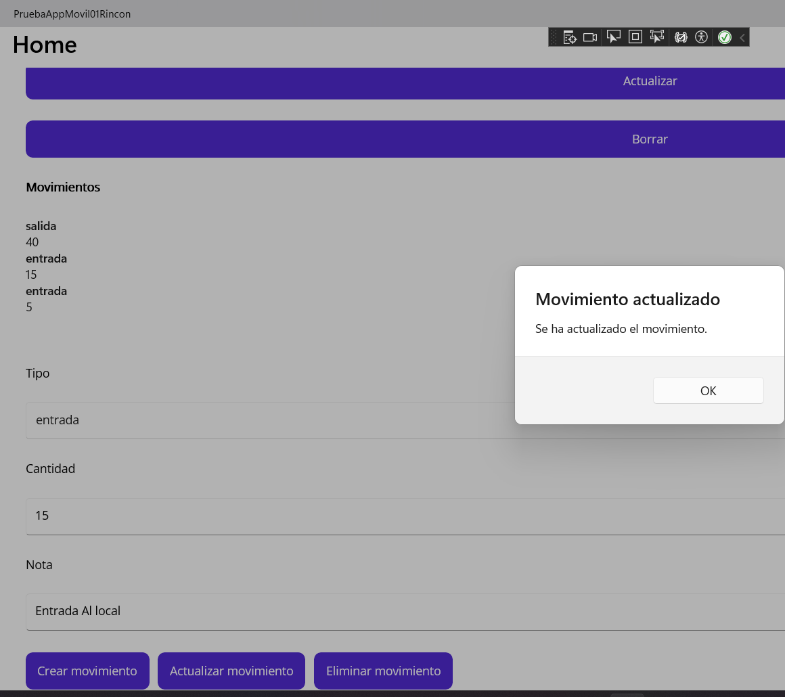
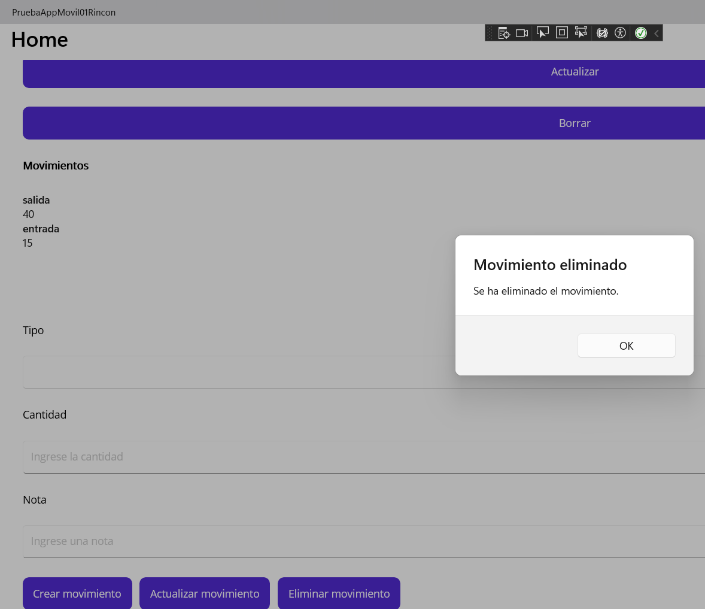

# CRUD App .NET MAUI + SQLite

Aplicación desarrollada en **.NET MAUI** utilizando **SQLite** como base de datos local.
El proyecto implementa operaciones CRUD (**Create, Read, Update y Delete**) mediante una arquitectura **Maestro-Detalle** para la gestión de **Productos** y **Movimientos**.

## Tecnologías utilizadas

* .NET MAUI
* SQLite
* C#

---

# Funcionalidades

## Gestión de Productos

* Crear productos
* Visualizar productos
* Actualizar productos
* Eliminar productos

### Evidencias

#### Visualización de Productos

```md

```

#### Actualización de Productos

```md

```

#### Eliminación de Productos

```md

```

---

## Gestión de Movimientos

* Crear movimientos
* Visualizar movimientos
* Actualizar movimientos
* Eliminar movimientos

### Evidencias

#### Visualización de Movimientos

```md

```

#### Actualización de Movimientos

```md

```

#### Eliminación de Movimientos

```md

```

---

# Arquitectura Maestro-Detalle

La aplicación utiliza el patrón **Maestro-Detalle**, permitiendo:

* Navegación organizada
* Separación de vistas
* Mejor experiencia de usuario
* Gestión eficiente de información relacionada

---

# Base de Datos SQLite

La información se almacena localmente mediante SQLite, permitiendo:

* Persistencia de datos
* Operaciones rápidas
* Uso sin conexión
* Integración sencilla con .NET MAUI

---

# Cómo ejecutar el proyecto

1. Clonar el repositorio:

```bash
git clone https://github.com/JAndresRG2024/AppSqliteRincon.git
```

2. Abrir el proyecto en:

* Visual Studio 2022 o superior

3. Restaurar paquetes NuGet

4. Ejecutar la aplicación en:

* Android
* Windows

---

# Autor

Desarrollado por Andrés Rincón.
